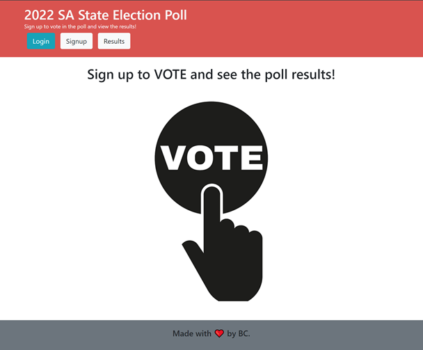
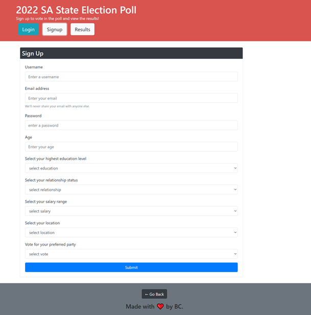
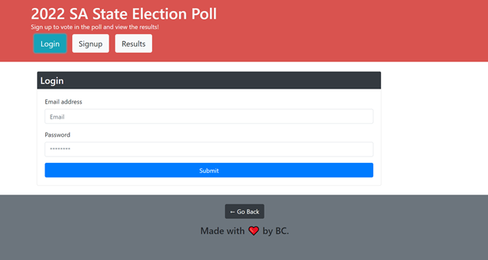
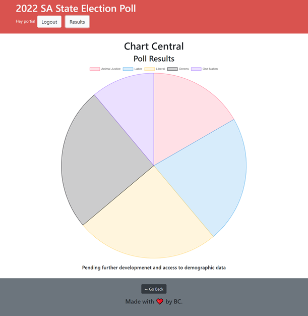
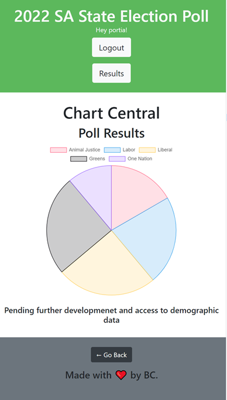

## MERN Election Poll Website

## Table of Contents
* [GitHub](#GitHub)
* [Description](#description)
* [Installation Instructions](#installation-instructions)
* [Usage Instructions](#usage-instructions)
* [Contribution Guidelines](#contribution-guidelines)
* [Test](#test)
* [Questions](#questions)
* [License](#license)

## GitHub
My GitHub username is B3nj1e. 
Please click [here](https://github.com/B3nj1e) to access my GitHub profile and the associated repository [here](https://github.com/B3nj1e/MERN-Election-Poll). To access the deploy application on Heroku please click [here](https://mern-election-poll.herokuapp.com/).

## Description
An election poll application, for the 2022 SA State election. Users must sign up; entering required demographic data, and then cast their vote. Once the user has signed up and logged in, they are able to view the poll results. 

Developments in the future will include demographic data based on party preference. 

This project meets the following requirements: 

* Use React for the front end.

* Use GraphQL with a Node.js and Express.js server.

* Use MongoDB and the Mongoose ODM for the database.

* Use queries and mutations for retrieving, adding, updating, and deleting data.

* Is deployed using Heroku (with data).

* Has a polished UI.

* Is responsive.

* Is interactive (i.e., accept and respond to user input).

* Includes authentication (JWT).

* Protects sensitive API key information on the server.

## Installation Instructions
To use the application, please download all associated files off the [GitHub repository](https://github.com/B3nj1e/MERN-Election-Poll). Ensure node.js is installed. In the terminal run ``npm i`` to install the dependencies and packages. Once you have install the packages, run ``npm build`` and ``npm seed`` to build the required files and populate the database. Next run ``npm run develop`` to view in a development environment, and navigate to localhost:3000 in your browser. Otherwise run ``npm start``.

## Usage Instructions
This application is designed to give third parties an insight into the potential political preferences, and demographic data associated with these preferences. This data can then be used to assist in direction election campaign efforts to potentially target weak demographic area. 

## Contribution Guidelines
If you think you can improve this application, please feel free to make contributions. I will review these changes on GitHub prior to merging them to the main branch.

## Test
To quickly test the application, follow the installation instructions above and run on localhost or navigate to the deployed application on [heroku](https://mern-election-poll.herokuapp.com/). Open the inspect function on your browser and check the following...

Below: Upon loading the application, the landing homepage is displayed. 

Below: To enter an election poll vote you must sign up and complete the demographic data form. 

Below: Once signed up, log into to access the poll result 

Below: A pie chart representing the current election poll results, with parties labelled and number of poll votes cast for each.

Below: Demonstration of responsive design.

## Questions
If you have any questions or would like to report an issue with the application, please contact me vie my email at blankemail@email.com(left blank for privacy concerns). Alternative contact me via my [GitHub account](https://github.com/B3nj1e). 

## License
If you require more information concerning the license, please click [here](https://choosealicense.com/licenses/).

---------------------

MIT License

Copyright (c) 2021 B3nj1e

Permission is hereby granted, free of charge, to any person obtaining a copy
of this software and associated documentation files (the "Software"), to deal
in the Software without restriction, including without limitation the rights
to use, copy, modify, merge, publish, distribute, sublicense, and/or sell
copies of the Software, and to permit persons to whom the Software is
furnished to do so, subject to the following conditions:

The above copyright notice and this permission notice shall be included in all
copies or substantial portions of the Software.

THE SOFTWARE IS PROVIDED "AS IS", WITHOUT WARRANTY OF ANY KIND, EXPRESS OR
IMPLIED, INCLUDING BUT NOT LIMITED TO THE WARRANTIES OF MERCHANTABILITY,
FITNESS FOR A PARTICULAR PURPOSE AND NONINFRINGEMENT. IN NO EVENT SHALL THE
AUTHORS OR COPYRIGHT HOLDERS BE LIABLE FOR ANY CLAIM, DAMAGES OR OTHER
LIABILITY, WHETHER IN AN ACTION OF CONTRACT, TORT OR OTHERWISE, ARISING FROM,
OUT OF OR IN CONNECTION WITH THE SOFTWARE OR THE USE OR OTHER DEALINGS IN THE
SOFTWARE.